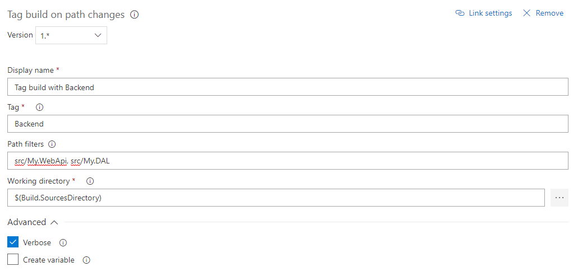
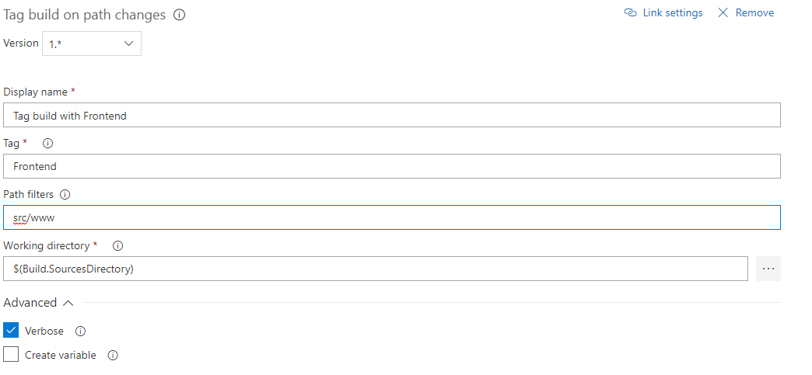

# TagBuildOnPathChanges
This extension enables you to tag your build with VSTS / TFS tags during the build, based on path filters (much like the filters which you can set for build triggers.)

## Example
Assume you have a build that builds 2 components, an API and an AngularJS frontend application.  
If changes are made to the API or the DAL, you want to add a tag "Backend".
Consequently, if changes are made to the frontend application, you want to tag the build with "Frontend"  

This can be achieved by adding 2 tasks to your build flow and configuring them as follows:

## Further reading
More information about this can be found in my [blog post](http://dirk.schuermans.me/?p=817) (from before it was an extension)